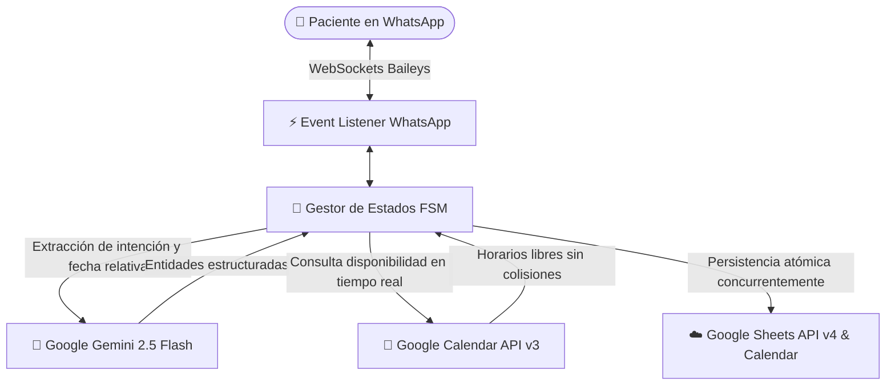

<div align="center">
  <h1>🦷 Asistente Virtual Odontológico con IA Híbrida</h1>
  <p><strong>Bot autónomo de WhatsApp para agendamiento inteligente de citas clínicas en tiempo real</strong></p>
  <p>
    
    
    
    
    
    
  </p>
</div>

---

## 📌 Descripción General

**Asistente Virtual Odontológico** es un sistema backend autónomo diseñado para clínicas dentales y consultorios de salud. Resuelve la pérdida de pacientes y fricción operativa automatizando el flujo completo de consulta, validación de disponibilidad y confirmación de citas mediante WhatsApp 24/7, procesando lenguaje natural y asegurando consistencia atómica sin sobrecupos (*overbooking*).

---

## 🏗️ Arquitectura Híbrida: NLP + Máquina de Estados Finita (FSM)

A diferencia de los asistentes basados únicamente en prompts directos de LLM (propensos a alucinaciones de fechas, respuestas lentas o bucles conversacionales), este proyecto utiliza una **Arquitectura Híbrida**:



1. **Inteligencia en el Borde (Google Gemini 2.5 Flash):** Se encarga exclusivamente de la comprensión de lenguaje natural (NLP). Clasifica intenciones del paciente y extrae fechas relativas complejas (*"el próximo martes a las 4 de la tarde"*), apoyándose en un *System Prompt* inyectado con referencia temporal local para evitar desfases de calendario.
2. **Máquina de Estados Finita (FSM):** Una vez extraída la intención, el control de la conversación lo asume una FSM determinista y fuertemente tipada en TypeScript. Esto garantiza velocidad milimétrica, consistencia en la recolección de datos obligatorios (nombre, DNI/identificación, motivo de consulta) y cero alucinaciones.

---

## ✨ Características Principales

* **🛡️ Algoritmo Anti-Overbooking en Tiempo Real:** Antes de confirmar o bloquear un horario, consulta directamente los eventos de Google Calendar asegurando ventanas mínimas de separación entre turnos.
* **⚡ Escritura Concurrente y Atómica:** Al confirmar la cita, registra de forma paralela (`Promise.all`) el evento en Google Calendar y la fila con datos del paciente en Google Sheets, garantizando sincronización total entre recepción y el equipo médico.
* **🕒 Restricciones de Horario Comercial:** Validación automatizada para impedir agendamientos fuera de la jornada laboral o en días festivos/domingos.
* **🔒 Seguridad y Privacidad por Diseño:** Las credenciales de Google Cloud (`service-account.json`) y las llaves de sesión de WhatsApp (`auth_info_baileys/`) están estrictamente aisladas del repositorio y protegidas por variables de entorno.
* **🧪 Suite de Pruebas Automatizadas:** Cobertura de pruebas unitarias y de integración con **Vitest** simulando casos extremos de NLP y FSM.

---

## 📁 Estructura del Proyecto

```
automatizacion-whatsapp-odontologia/
├── docs/                   # Especificaciones técnicas, manual de defensa y arquitectura
│   ├── SPEC.md
│   ├── MANUAL_EXPOSICION.md
│   └── presupuesto_total_sistema.md
├── src/
│   ├── config/             # Validación estricta de variables de entorno (env.ts)
│   ├── services/
│   │   ├── ai.ts           # Integración con Google Gemini SDK
│   │   ├── calendar.ts     # Cliente Lazy Google Calendar API v3
│   │   ├── sheets.ts       # Cliente Lazy Google Sheets API v4
│   │   ├── scheduler.ts    # Lógica de validación de horarios y anti-overbooking
│   │   └── whatsapp.ts     # Conexión WebSocket y manejador de estados FSM
│   ├── utils/              # Parsers y formateadores de datos
│   ├── types.ts            # Definiciones de tipos e interfaces TypeScript
│   └── index.ts            # Punto de entrada de la aplicación
└── tests/                  # Suite de pruebas automatizadas (Vitest)
```

---

## 🛠️ Stack Tecnológico

* **Lenguaje:** [TypeScript](https://www.typescriptlang.org/)
* **Plataforma de Mensajería:** [@whiskeysockets/baileys](https://github.com/WhiskeySockets/Baileys) (WebSockets nativos de WhatsApp Web)
* **Inteligencia Artificial:** [@google/generative-ai](https://www.npmjs.com/package/@google/generative-ai) (Gemini 2.5 Flash)
* **Integraciones Cloud:** Google Calendar API v3, Google Sheets API v4
* **Testing:** [Vitest](https://vitest.dev/)

---

## 🚀 Instalación y Puesta en Marcha

### Prerrequisitos
* Node.js v18+ o v20+
* Administrador de paquetes `pnpm` o `npm`
* Cuenta en [Google Cloud Console](https://console.cloud.google.com/) con APIs de Calendar y Sheets habilitadas y una Service Account generada.
* API Key de [Google AI Studio](https://aistudio.google.com/).

### 1. Clonar y configurar dependencias
```bash
git clone https://github.com/Alecwce/automatizacion-whatsapp-odontologia.git
cd automatizacion-whatsapp-odontologia
pnpm install
```

### 2. Configurar variables de entorno
Crea tu archivo `.env` tomando como base `.env.example`:
```env
GEMINI_API_KEY="tu_gemini_api_key"
CALENDAR_ID="tu_id_de_google_calendar@group.calendar.google.com"
SPREADSHEET_ID="tu_id_de_google_sheet"
GOOGLE_APPLICATION_CREDENTIALS="./service-account.json"
```

Coloca el archivo descargado de tu cuenta de servicio de Google Cloud en la raíz del proyecto como `service-account.json`.

### 3. Ejecutar pruebas unitarias
```bash
pnpm test
```

### 4. Iniciar en modo desarrollo
```bash
pnpm dev
```
Escanea el código QR generado en la terminal con la cámara de WhatsApp para vincular la sesión.

---

## 📄 Licencia

Este proyecto está bajo la Licencia **MIT**. Consulta el archivo `LICENSE` para más información.
