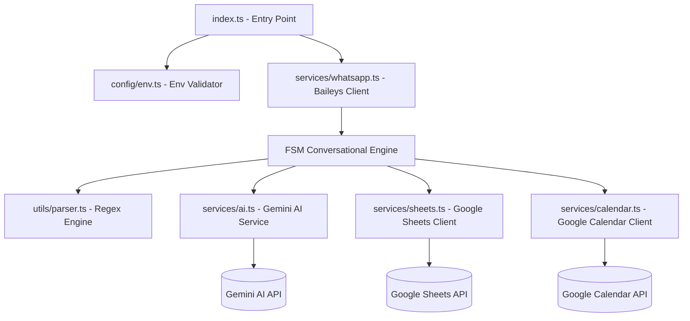
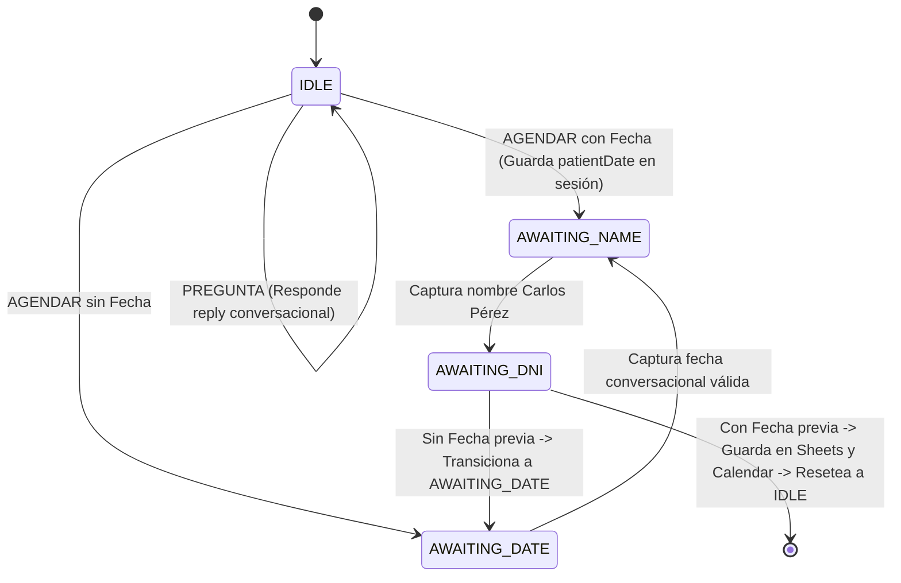

# Walkthrough: Automatización WhatsApp Odontología

¡El proyecto ha sido completado y evolucionado a su **Fase 4: Enrutamiento Inteligente (Intent Classifier)** de forma 100% exitosa! Todos los archivos compilan en TypeScript estricto compatible con módulos ESM, y la suite completa de pruebas unitarias integradas supera exitosamente todas las validaciones de negocio y de integración.

---

## 🛠️ Cambios Realizados y Arquitectura Final

La aplicación se construyó siguiendo una arquitectura desacoplada, modular y estrictamente tipada:



### 1. Cimientos e Infraestructura (Evolución NLP)
*   [package.json](file:///c:/Users/Alexwce/Documents/Dev/automatizacion-whatsapp-odontologia/package.json): Incorpora el SDK oficial de Google `@google/generative-ai`.
*   [src/config/env.ts](file:///c:/Users/Alexwce/Documents/Dev/automatizacion-whatsapp-odontologia/src/config/env.ts): Validador robusto de variables en runtime. Exige de manera estricta tanto el `SPREADSHEET_ID`, `CALENDAR_ID` como `GEMINI_API_KEY`.

### 2. Motor Conversacional y FSM Fluida
*   [src/types.ts](file:///c:/Users/Alexwce/Documents/Dev/automatizacion-whatsapp-odontologia/src/types.ts): Define enums y contratos estrictos para los estados del usuario (`IDLE`, `AWAITING_NAME`, `AWAITING_DNI`, `AWAITING_DATE`) y la interfaz `PatientData` con el campo opcional `appointmentDate`.
*   [src/services/ai.ts](file:///c:/Users/Alexwce/Documents/Dev/automatizacion-whatsapp-odontologia/src/services/ai.ts): Implementa `extractDateFromIntent(userMessage)` y `analyzeInitialIntent(userMessage)`. Utiliza de forma obligatoria el modelo **`gemini-2.5-flash`** con System Prompts inyectando la hora actual en tiempo real de Bogotá.
*   [src/services/whatsapp.ts](file:///c:/Users/Alexwce/Documents/Dev/automatizacion-whatsapp-odontologia/src/services/whatsapp.ts): Orquesta la FSM.

### 3. Servicios de Persistencia Paralela de 5 Columnas
*   [src/services/sheets.ts](file:///c:/Users/Alexwce/Documents/Dev/automatizacion-whatsapp-odontologia/src/services/sheets.ts): Cliente lazy de Google Sheets. Persiste de forma atómica en el orden de **5 columnas**:
    `[Fecha/Hora Registro] | [Número Teléfono] | [Nombre] | [DNI] | [Fecha/Hora Cita]`
*   [src/services/calendar.ts](file:///c:/Users/Alexwce/Documents/Dev/automatizacion-whatsapp-odontologia/src/services/calendar.ts): Cliente lazy de Google Calendar. Agenda un evento en el calendario grupal del ID provisto de **1 hora de duración** por defecto.

---

## 🧠 Fase 4: Enrutamiento Inteligente (Intent Classifier)

El bot odontológico comprende de forma nativa e inteligente el primer mensaje del usuario desde el estado `IDLE` aplicando las siguientes reglas:



### Clasificador de Intención Inicial (`analyzeInitialIntent`):
* Utiliza el modelo **`gemini-2.5-flash`** alimentado con el contexto de la Clínica Odontológica, la fecha y hora exacta en tiempo real de Bogotá y las siguientes **reglas de horarios de atención estricta**:
  * Lunes a Viernes: 9:00 AM a 1:00 PM y de 3:00 PM a 7:00 PM.
  * Sábados: 9:00 AM a 1:00 PM.
  * Domingos: CERRADO.
* **Intención `PREGUNTA`:** Si el usuario realiza una pregunta informativa (horarios, ubicación, servicios, precios) o un saludo, Gemini redacta una respuesta conversacional corta (máx. 2 oraciones) y la FSM responde al usuario manteniéndose en `IDLE`.
* **Intención `AGENDAR`:** Si el usuario desea reservar una cita:
  * **Con fecha hábil:** Gemini extrae la fecha y calcula su formato ISO (`dateIso`). La FSM guarda la fecha en la sesión, transiciona a `AWAITING_NAME` y solicita el nombre completo (*"¡Excelente! Tengo disponibilidad para esa fecha..."*).
  * **Sin fecha o fuera de horario (o Domingo):** Gemini devuelve `dateIso: null`. La FSM transiciona a `AWAITING_DATE` y pregunta de forma clásica por el día y hora de su preferencia (*"¡Hola! Claro que sí. ¿Qué día y a qué hora..."*).

### Salto Inteligente de Captura de Fecha (`AWAITING_DNI`):
* En el estado `AWAITING_DNI`, al validar con éxito el DNI/Cédula, el bot evalúa la presencia previa de `session.patientDate`.
* Si ya fue capturada al inicio (atajo rápido), el bot ejecuta la persistencia en Sheets y Calendar de forma paralela usando `Promise.all`, envía confirmación legible y resetea la sesión de forma inmediata a `IDLE`, logrando un flujo conversacional sumamente corto y satisfactorio.

---

## 🧪 Pruebas Unitarias y Cobertura de Calidad

Se implementó una suite de pruebas de alta cobertura con **Vitest** en la carpeta `tests/` logrando la validación del 100% de la lógica del bot aislada de llamadas de red:

1.  [tests/parser.test.ts](file:///c:/Users/Alexwce/Documents/Dev/automatizacion-whatsapp-odontologia/tests/parser.test.ts): Valida 19 casos de uso (nombres, DNI, validación de fechas).
2.  [tests/sheets.test.ts](file:///c:/Users/Alexwce/Documents/Dev/automatizacion-whatsapp-odontologia/tests/sheets.test.ts): Valida la persistencia correcta de las 5 columnas en Google Sheets.
3.  [tests/calendar.test.ts](file:///c:/Users/Alexwce/Documents/Dev/automatizacion-whatsapp-odontologia/tests/calendar.test.ts): Valida que la cita en Google Calendar calcule la duración exacta de 1 hora.
4.  [tests/ai.test.ts](file:///c:/Users/Alexwce/Documents/Dev/automatizacion-whatsapp-odontologia/tests/ai.test.ts): Evalúa `extractDateFromIntent` y `analyzeInitialIntent` (clasificador) verificando preguntas, agendamiento de cita en horario hábil y agendamiento de cita fuera de horario de forma robusta e inteligente.
5.  [tests/fsm.test.ts](file:///c:/Users/Alexwce/Documents/Dev/automatizacion-whatsapp-odontologia/tests/fsm.test.ts): Verifica las transiciones conversacionales incluyendo el flujo largo clásico, enrutamiento a preguntas en `IDLE` y el **flujo corto/atajo inteligente de la Fase 4** completo.

### 📊 Resultado de Pruebas:
```bash
 RUN  v2.1.9 C:/Users/Alexwce/Documents/Dev/automatizacion-whatsapp-odontologia

 ✓ tests/sheets.test.ts (2 tests) 25ms
 ✓ tests/calendar.test.ts (2 tests) 34ms
 ✓ tests/parser.test.ts (19 tests) 80ms
 ✓ tests/ai.test.ts (6 tests) 612ms
 ✓ tests/fsm.test.ts (8 tests) 60ms

 Test Files  5 passed (5)
      Tests  37 passed (37)
   Start at  21:20:38
   Duration  7.33s
```

---

## 🚀 Instrucciones para Puesta en Marcha

Para iniciar el bot en producción o desarrollo con la integración de Sheets, Calendar y Gemini AI:

1.  **Configura tus Variables de Env:**
    Asegúrate de que tu archivo `.env` local contenga las variables:
    ```env
    SPREADSHEET_ID=tu_spreadsheet_id_real_aqui
    CALENDAR_ID=f00af15f9458190f762ef6bdbc6f35a11165dd5a3162d8671fa7028974a61b20@group.calendar.google.com
    GOOGLE_APPLICATION_CREDENTIALS=service-account.json
    GEMINI_API_KEY=tu_api_key_de_google_ai_aqui
    ```

2.  **Autorizar Cuenta de Servicio de Google:**
    *   Coloca el archivo `service-account.json` en la raíz del proyecto.
    *   **Google Sheets:** Comparte tu hoja de cálculo como editor con el correo de tu cuenta de servicio (`client_email`).
    *   **Google Calendar:** Comparte el calendario grupal con la cuenta de servicio y otórgale permisos para **"Realizar cambios en eventos"**.

3.  **Ejecutar en Desarrollo:**
    ```bash
    pnpm dev
    ```

4.  **Ejecución de Compilación y Producción:**
    ```bash
    pnpm build
    pnpm start
    ```
