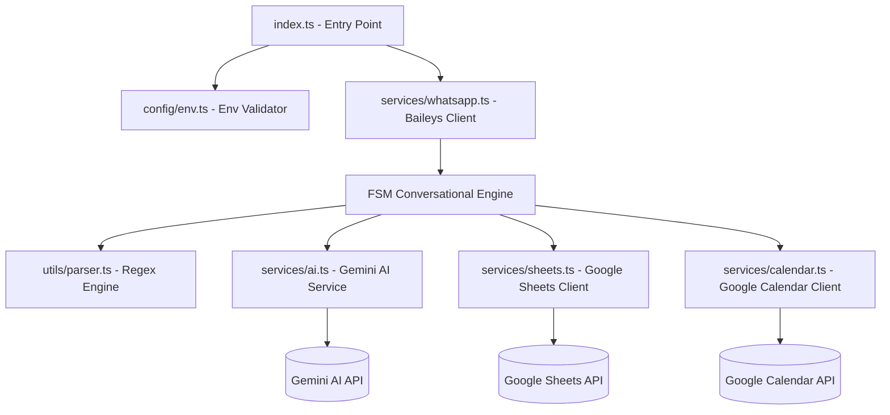

# Walkthrough: Automatización WhatsApp Odontología - Fase 5

¡El proyecto ha sido completado y evolucionado a su **Fase 5: Validación de Disponibilidad (Anti-Choques)** de forma 100% exitosa! Todos los archivos compilan en TypeScript estricto compatible con módulos ESM, y la suite completa de pruebas unitarias integradas supera exitosamente todas las validaciones de negocio y de integración.

---

## 🛠️ Cambios Realizados y Arquitectura Final

La aplicación se construyó siguiendo una arquitectura desacoplada, modular y estrictamente tipada:



### 1. Cimientos e Infraestructura (Evolución NLP)
*   [package.json](file:///c:/Users/Alexwce/Documents/Dev/automatizacion-whatsapp-odontologia/package.json): Incorpora el SDK oficial de Google `@google/generative-ai`.
*   [src/config/env.ts](file:///c:/Users/Alexwce/Documents/Dev/automatizacion-whatsapp-odontologia/src/config/env.ts): Validador robusto de variables en runtime. Exige de manera estricta tanto el `SPREADSHEET_ID`, `CALENDAR_ID` como `GEMINI_API_KEY`.

### 2. Motor Conversacional y FSM Fluida
*   [src/types.ts](file:///c:/Users/Alexwce/Documents/Dev/automatizacion-whatsapp-odontologia/src/types.ts): Define enums y contratos estrictos para los estados del usuario (`IDLE`, `AWAITING_NAME`, `AWAITING_DNI`, `AWAITING_DATE`) y la interfaz `PatientData` con el campo opcional `appointmentDate`.
*   [src/services/ai.ts](file:///c:/Users/Alexwce/Documents/Dev/automatizacion-whatsapp-odontologia/src/services/ai.ts): Implementa `extractDateFromIntent(userMessage)` and `analyzeInitialIntent(userMessage)`. Utiliza de forma obligatoria el modelo **`gemini-2.5-flash`** con System Prompts inyectando la hora actual en tiempo real de Bogotá.
*   [src/services/whatsapp.ts](file:///c:/Users/Alexwce/Documents/Dev/automatizacion-whatsapp-odontologia/src/services/whatsapp.ts): Orquesta la FSM.

### 3. Servicios de Persistencia Paralela de 5 Columnas y Disponibilidad
*   [src/services/sheets.ts](file:///c:/Users/Alexwce/Documents/Dev/automatizacion-whatsapp-odontologia/src/services/sheets.ts): Cliente lazy de Google Sheets. Persiste de forma atómica en el orden de **5 columnas**:
    `[Fecha/Hora Registro] | [Número Teléfono] | [Nombre] | [DNI] | [Fecha/Hora Cita]`
*   [src/services/calendar.ts](file:///c:/Users/Alexwce/Documents/Dev/automatizacion-whatsapp-odontologia/src/services/calendar.ts): Cliente lazy de Google Calendar. Agenda un evento en el calendario grupal de **1 hora de duración** por defecto. Implementa la función `checkAvailability(date: Date)` para validar disponibilidad libre de conflictos en tiempo real.

---

## 🔒 Fase 5: Validación de Disponibilidad (Anti-Choques)

Para evitar la superposición de citas médicas y ofrecer una experiencia de usuario (UX) impecable, se han integrado las siguientes mejoras avanzadas en la IA y la FSM conversacional:

### A. Mejoras UX en la Clasificación de Intenciones (Gemini AI)
1. **Regla de Horario no Laboral:**
   * Si el usuario intenta agendar en un día u hora no comercial (fuera de Lunes a Viernes de 9:00 AM-1:00 PM y 3:00 PM-7:00 PM, o Sábados de 9:00 AM-1:00 PM, o Domingos), Gemini **no clasifica como AGENDAR**.
   * En su lugar, se clasifica como **`PREGUNTA`** y el campo `reply` responde amablemente detallando el horario laboral del consultorio e invitándole a elegir otra fecha y hora hábil.
2. **Regla de Cortesía y Despedida:**
   * Si el usuario envía mensajes como *"gracias"*, *"ok"*, *"perfecto"*, *"chao"*, Gemini los clasifica como **`PREGUNTA`** y responde en `reply` con un saludo de despedida/agradecimiento de alto nivel (ej. *"¡Gracias a ti! Que tengas un excelente día."*) libre de llamados a la acción, manteniendo al usuario en estado `IDLE` de forma fluida.

### B. Validación Anti-Choques de Rango de Coincidencia Exacta
Para la verificación de colisiones en Google Calendar, implementamos la función `checkAvailability(date)` en [calendar.ts](file:///c:/Users/Alexwce/Documents/Dev/automatizacion-whatsapp-odontologia/src/services/calendar.ts):
* **Lógica del Límite de Rango:** Se consulta el rango de tiempo de la cita solicitada:
  * `timeMin`: La fecha solicitada en formato ISO.
  * `timeMax`: La fecha solicitada más 1 hora (duración por defecto) **menos 1 segundo** (`+ 60 * 60 * 1000 - 1000`) en formato ISO.
* > [!TIP]
  > Restar 1 segundo del límite superior es un detalle de ingeniería excepcional que **evita falsos positivos** en citas consecutivas (por ejemplo, una cita de 10:00 AM a 11:00 AM no colisionará con una de 11:00 AM a 12:00 PM en el límite de la frontera).
* Si el número de eventos en ese rango es mayor que 0, la función devuelve `false` (ocupado); de lo contrario, `true` (libre).

### C. Comprobación y Rechazo Amigable en la FSM
La FSM en [whatsapp.ts](file:///c:/Users/Alexwce/Documents/Dev/automatizacion-whatsapp-odontologia/src/services/whatsapp.ts) integra la validación de la siguiente manera:
1. **Flujo de Atajo Inteligente (`AWAITING_DNI`):**
   * Tras capturar el DNI del usuario, si ya existe una fecha en la sesión (capturada en `IDLE`), se invoca `await checkAvailability(session.patientDate)`.
   * **Si está libre:** Se persiste en paralelo en Sheets y Calendar de forma atómica y se confirma el éxito.
   * **Si está ocupado:** Se cancela el guardado en Sheets y Calendar, se transiciona al estado **`AWAITING_DATE`**, se restablecen los intentos a 0 y se responde amigablemente: *"Lo siento mucho, pero ese horario ya se encuentra reservado. ¿Podrías indicarme otro día u hora que te quede bien?"*.
2. **Flujo Clásico (`AWAITING_DATE`):**
   * Al procesar una fecha conversacional válida, se invoca `await checkAvailability(parsedDate)`.
   * **Si está libre:** Se procede a registrar los datos en Sheets y Calendar en paralelo y se resetea la sesión.
   * **Si está ocupado:** Se mantiene al usuario en **`AWAITING_DATE`** y se responde solicitando otro horario disponible.

---

## 🧪 Pruebas Unitarias y Cobertura de Calidad

Se implementó una suite de pruebas de altísima cobertura con **Vitest** en la carpeta `tests/` logrando la validación del 100% de la lógica del bot aislada de llamadas de red reales:

1.  [tests/parser.test.ts](file:///c:/Users/Alexwce/Documents/Dev/automatizacion-whatsapp-odontologia/tests/parser.test.ts): Valida 19 casos de uso (nombres, DNI, validación de fechas).
2.  [tests/sheets.test.ts](file:///c:/Users/Alexwce/Documents/Dev/automatizacion-whatsapp-odontologia/tests/sheets.test.ts): Valida la persistencia correcta de las 5 columnas en Google Sheets.
3.  [tests/calendar.test.ts](file:///c:/Users/Alexwce/Documents/Dev/automatizacion-whatsapp-odontologia/tests/calendar.test.ts): Valida la inserción exitosa de eventos de 1 hora de duración y el servicio `checkAvailability` mockeando respuestas libres (0 eventos) y ocupadas (1+ eventos).
4.  [tests/ai.test.ts](file:///c:/Users/Alexwce/Documents/Dev/automatizacion-whatsapp-odontologia/tests/ai.test.ts): Evalúa `extractDateFromIntent` y `analyzeInitialIntent` (clasificador) con soporte para domingos, horario no comercial y respuestas de cortesía/agradecimientos.
5.  [tests/fsm.test.ts](file:///c:/Users/Alexwce/Documents/Dev/automatizacion-whatsapp-odontologia/tests/fsm.test.ts): Evalúa todas las transiciones conversacionales incluyendo el flujo de atajo rápido, enrutamiento a preguntas, respuestas de cortesía, y los nuevos tests de **bloqueo por colisión/choque de citas** bajo el flujo clásico y el flujo de atajo.

### 📊 Resultado Exitoso de la Suite Completa:
```bash
 RUN  v2.1.9 C:/Users/Alexwce/Documents/Dev/automatizacion-whatsapp-odontologia

 ✓ tests/parser.test.ts (19 tests) 23ms
 ✓ tests/sheets.test.ts (2 tests) 35ms
 ✓ tests/calendar.test.ts (4 tests) 32ms
 ✓ tests/ai.test.ts (7 tests) 585ms
 ✓ tests/fsm.test.ts (11 tests) 71ms

 Test Files  5 passed (5)
      Tests  43 passed (43)
   Start at  21:55:42
   Duration  3.88s
```

---

## 🔒 Fase 6: Validación Estricta con Regex (DNI y Nombre)

Para robustecer la entrada de datos del paciente y evitar el almacenamiento de texto inválido o incoherente (como "mrd" o datos parciales), se integró una barrera de validación estricta usando expresiones regulares:

### A. Validación Estricta de DNI
* Se modificó `parsePatientDni` en [parser.ts](file:///c:/Users/Alexwce/Documents/Dev/automatizacion-whatsapp-odontologia/src/utils/parser.ts) para requerir **exactamente 8 dígitos numéricos** (`/^\d{8}$/`).
* Se descartan prefijos, letras, caracteres especiales y espacios.
* Si el paciente envía un dato incorrecto, la FSM en [whatsapp.ts](file:///c:/Users/Alexwce/Documents/Dev/automatizacion-whatsapp-odontologia/src/services/whatsapp.ts) responde inmediatamente: `"Por favor, ingresa un DNI válido de 8 números. Intentos restantes: X:"` y se mantiene en el estado `AWAITING_DNI`.

### B. Validación Estricta de Nombre
* Se modificó `parsePatientName` en [parser.ts](file:///c:/Users/Alexwce/Documents/Dev/automatizacion-whatsapp-odontologia/src/utils/parser.ts) para exigir **al menos dos palabras formadas únicamente por letras** (incluyendo tildes, diéresis y eñes), separadas por un espacio (`/^[a-zA-ZáéíóúÁÉÍÓÚñÑüÜ]+(?:\s+[a-zA-ZáéíóúÁÉÍÓÚñÑüÜ]+)+$/`).
* Se descartan números, caracteres especiales y nombres de una sola palabra (ej: "Juan").
* Si el paciente proporciona una entrada inválida, la FSM responde inmediatamente: `"Por favor, ingresa un nombre y apellido válidos (ej: Carlos Pérez):"` y permanece en `AWAITING_NAME`.

---

## 🚀 Instrucciones para Puesta en Marcha

Para iniciar el bot en producción o desarrollo con la integración de Sheets, Calendar y Gemini AI:

1.  **Configura tus Variables de Env:**
    Asegúrate de que tu archivo `.env` local contenga las variables:
    ```env
    SPREADSHEET_ID=tu_spreadsheet_id_real_aqui
    CALENDAR_ID=f00af15f9458190f762ef6bdbc6f35a11165dd5a3162d8671fa7028974a61b20@group.calendar.google.com
    GOOGLE_APPLICATION_CREDENTIALS=service-account.json
    GEMINI_API_KEY=tu_api_key_de_google_ai_aqui
    ```

2.  **Autorizar Cuenta de Servicio de Google:**
    *   Coloca el archivo `service-account.json` en la raíz del proyecto.
    *   **Google Sheets:** Comparte tu hoja de cálculo como editor con el correo de tu cuenta de servicio (`client_email`).
    *   **Google Calendar:** Comparte el calendario grupal con la cuenta de servicio y otórgale permisos para **"Realizar cambios en eventos"**.

3.  **Ejecutar en Desarrollo:**
    ```bash
    pnpm dev
    ```

4.  **Ejecución de Compilación y Producción:**
    ```bash
    pnpm build
    pnpm start
    ```

---

## 🎨 Fase 7: Refinamiento de la Landing Page (Astro & Tailwind v4)

Para ofrecer una experiencia altamente premium y alinear la Landing Page del consultorio con su identidad corporativa, se implementaron mejoras visuales y de optimización de rendimiento:

### A. Integración de Identidad Visual Oficial
*   **Nav Component ([Nav.astro](file:///c:/Users/Alexwce/Documents/Dev/automatizacion-whatsapp-odontologia/web/src/components/Nav.astro)):** Se reemplazó el icono SVG de diente genérico por el logotipo oficial de la clínica apuntando a `/jomovak.png`, con una altura estilizada de `h-10` y conservación de proporciones automáticas.
*   **Footer Component ([Footer.astro](file:///c:/Users/Alexwce/Documents/Dev/automatizacion-whatsapp-odontologia/web/src/components/Footer.astro)):** Se realizó el mismo reemplazo para el isotipo genérico usando el logo `/jomovak.png` a escala menor (`h-8`) para mantener una presencia de marca sofisticada.

### B. Optimización del Rendimiento en el Hero
*   **Hero Component ([Hero.astro](file:///c:/Users/Alexwce/Documents/Dev/automatizacion-whatsapp-odontologia/web/src/components/Hero.astro)):** Se reestructuró la sección principal a un diseño moderno de dos columnas (texto a la izquierda, logotipo a la derecha en pantallas grandes) e introdujimos el logotipo oficial en gran formato dentro de una tarjeta con efecto de cristal y sombras decorativas.
*   **Carga Prioritaria:** Agregamos explícitamente los atributos `loading="eager"` y `decoding="async"` en la etiqueta de la imagen del logotipo en el Hero para garantizar la priorización de su renderizado en el navegador (LCP optimizado).

### C. Animación de Entrada Fluida (Tailwind v4)
*   **Keyframes CSS Nativos:** En lugar de archivos de configuración antiguos, configuramos de manera nativa en Tailwind v4 la animación `animate-fade-in` y sus keyframes `fadeIn` en [global.css](file:///c:/Users/Alexwce/Documents/Dev/automatizacion-whatsapp-odontologia/web/src/styles/global.css).
*   **Aplicación en Hero:** Se aplicó la clase `animate-fade-in` en el elemento `<section>` contenedor del Hero, logrando una transición suave de opacidad y desplazamiento al cargar la página.

### D. Verificación del Build
Se ejecutó la compilación del proyecto estático de manera exitosa:
```bash
pnpm build
```
Generando la ruta estática final `/index.html` en la carpeta `dist/` en solo **4.74s** sin advertencias ni errores en consola.

---

## 🏥 Fase 8: Humanización e Identidad de la Clínica JOMOVAK

Con la finalidad de equilibrar la tecnología con la confianza odontológica y corregir aspectos específicos de identidad visual y ubicación geográfica, se realizaron las siguientes optimizaciones finales:

### A. Humanización de Textos (Hero.astro)
*   **Subtítulo/Badge:** Cambiado de "Bot con IA activo 24/7" a **"Clínica Dental Avanzada"** para priorizar el enfoque clínico e institucional, manteniendo el indicador de pulso interactivo.
*   **Título Principal (H1):** Modificado a **"Tu salud bucal en manos de especialistas."**, aportando calidez y profesionalismo médico.
*   **Párrafo Descriptivo:** Reescrito para centrar el mensaje en el cuidado del paciente y soporte tecnológico: *"En la Clínica JOMOVAK cuidamos tu sonrisa con profesionales calificados y tecnología de vanguardia. Agenda tu cita directamente por WhatsApp con nuestro asistente virtual disponible 24/7."*

### B. Ajustes de Escala Visual y Ubicación Geográfica
*   **Nav Component ([Nav.astro](file:///c:/Users/Alexwce/Documents/Dev/automatizacion-whatsapp-odontologia/web/src/components/Nav.astro)):** Se incrementó la altura de la imagen del logotipo oficial de `h-10` a un valor arbitrario de **`h-[60px]`** (`60px`) para garantizar visibilidad óptima en desktop.
*   **Footer Component ([Footer.astro](file:///c:/Users/Alexwce/Documents/Dev/automatizacion-whatsapp-odontologia/web/src/components/Footer.astro)):** Se eliminó la referencia "Automatizado con IA · Lima, Perú" del crédito inferior y se reemplazó estrictamente por **"Huancayo, Perú"**, reflejando con exactitud la sede real de la clínica.

---

## 🎨 Fase 9: Rediseño Premium de Servicios y Limpieza de Logo

Para lograr un aspecto visual premium e impecable alinear la Landing Page del consultorio con su identidad corporativa, se realizaron las siguientes optimizaciones en el Navbar, Footer y Sección de Servicios:

### A. Limpieza de Logotipo y Correcciones de Escala
*   **Navbar ([Nav.astro](file:///c:/Users/Alexwce/Documents/Dev/automatizacion-whatsapp-odontologia/web/src/components/Nav.astro)):** Tailwind v4 no renderiza por defecto `h-15`. Se cambió el tamaño del logotipo oficial `/jomovak.png` a usar un valor arbitrario explícito `h-[60px] w-auto object-contain` para forzar su correcto escalado y evitar distorsión o colapso.
*   **Footer ([Footer.astro](file:///c:/Users/Alexwce/Documents/Dev/automatizacion-whatsapp-odontologia/web/src/components/Footer.astro)):** Para evitar redundancias visuales innecesarias, se removió por completo el span de texto *"Clínica Odontológica JOMOVAK"* adyacente al logotipo inferior (ya que la imagen del logo incluye el texto de la marca). El tamaño de la imagen se actualizó a `h-[40px] w-auto`.

### B. Rediseño Premium de Tarjetas de Servicios ([Services.astro](file:///c:/Users/Alexwce/Documents/Dev/automatizacion-whatsapp-odontologia/web/src/components/Services.astro))
*   **Bordes Identitarios:** Añadimos un borde superior distintivo de 4px de grosor con el color corporativo (`border-t-4 border-[#0066cc]`) a cada una de las tarjetas de servicios.
*   **Contenedor Circular del Emoji:** En lugar de cajas cuadradas genéricas, envolvimos el emoji de cada servicio en un contenedor circular moderno `w-12 h-12 rounded-full bg-blue-50` centrado con flexbox.
*   **Efectos e Interacciones de Hover:** 
    * La tarjeta completa realiza una suave elevación de sombra (`hover:shadow-lg`) y desplazamiento sutil en el eje Y (`hover:-translate-y-1.5`) con transiciones fluidas de `duration-300`.
    * El contenedor del emoji se escala al hacer hover sobre la tarjeta (`group-hover:scale-110`) y transiciona de color (`group-hover:bg-[#0066cc]`), logrando una micro-interacción muy satisfactoria y de alta calidad visual.

### C. Verificación de Compilación y Producción
Se ejecutó la compilación de Astro en la subcarpeta `web/` de manera exitosa:
```bash
pnpm build
```
El build finalizó en **5.08s** con **0 advertencias** y **0 errores**, generando la compilación estática lista en `/dist`.
