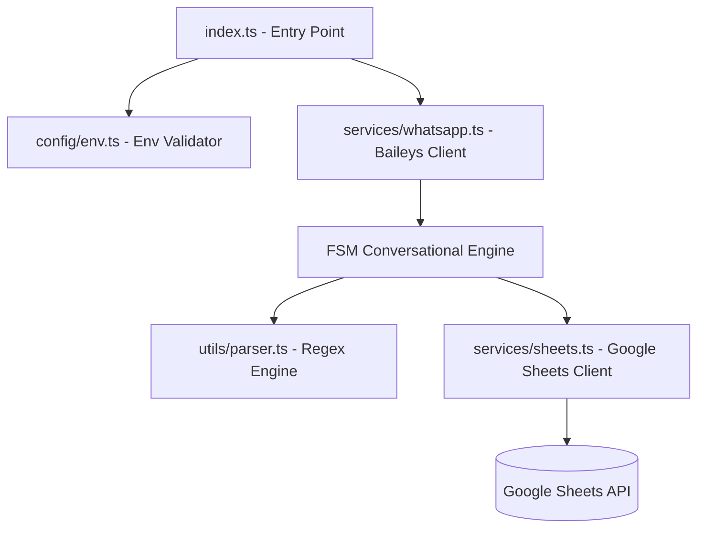

# Walkthrough: Automatización WhatsApp Odontología

¡El proyecto ha sido implementado en su totalidad y de forma 100% exitosa! Todos los archivos compilan en TypeScript estricto compatible con módulos ESM, y la suite completa de pruebas unitarias integradas supera con éxito todas las validaciones.

---

## 🛠️ Cambios Realizados y Arquitectura Final

La aplicación se construyó siguiendo una arquitectura desacoplada, modular y estrictamente tipada:



### 1. Cimientos e Infraestructura
*   [package.json](file:///c:/Users/Alexwce/Documents/Dev/automatizacion-whatsapp-odontologia/package.json): Definido con `"type": "module"`, scripts para desarrollo (`tsx`), compilación de producción y testing (`vitest`).
*   [tsconfig.json](file:///c:/Users/Alexwce/Documents/Dev/automatizacion-whatsapp-odontologia/tsconfig.json): Configurado con modo estricto de TypeScript y resolución moderna de módulos Node.js (`NodeNext`).
*   [pnpm-workspace.yaml](file:///c:/Users/Alexwce/Documents/Dev/automatizacion-whatsapp-odontologia/pnpm-workspace.yaml) & [.npmrc](file:///c:/Users/Alexwce/Documents/Dev/automatizacion-whatsapp-odontologia/.npmrc): Configurados bajo las directivas oficiales de **pnpm v11** para resolver de forma segura subdependencias de repositorios Git de Baileys (`blockExoticSubdeps: false`) y autorizar las compilaciones locales de scripts (`allowBuilds`).
*   [src/config/env.ts](file:///c:/Users/Alexwce/Documents/Dev/automatizacion-whatsapp-odontologia/src/config/env.ts): Carga y valida variables de entorno mediante `dotenv`, garantizando que falte rápido (*Fail-Fast*) si no está configurada la hoja de Google Sheets.

### 2. Motor Conversacional y FSM
*   [src/types.ts](file:///c:/Users/Alexwce/Documents/Dev/automatizacion-whatsapp-odontologia/src/types.ts): Define enums y contratos estrictos para los estados del usuario (`IDLE`, `AWAITING_NAME`, `AWAITING_DNI`), la estructura de datos del paciente, y respuestas de parsing.
*   [src/utils/parser.ts](file:///c:/Users/Alexwce/Documents/Dev/automatizacion-whatsapp-odontologia/src/utils/parser.ts): Motor Regex determinista (sin IA) que normaliza nombres de paciente (limpiando prefijos como "me llamo", "soy") y extrae DNI y Cédulas (capturando números de 7 a 10 dígitos o formatos con letras tipo V-12345678).
*   [src/services/whatsapp.ts](file:///c:/Users/Alexwce/Documents/Dev/automatizacion-whatsapp-odontologia/src/services/whatsapp.ts): Gestiona la conexión del socket de Baileys, persistiendo las sesiones localmente en `auth_info_baileys` para evitar escanear el QR repetidamente, y procesando cada chat de manera asíncrona mediante la FSM conversacional por usuario.

### 3. Persistencia de Datos
*   [src/services/sheets.ts](file:///c:/Users/Alexwce/Documents/Dev/automatizacion-whatsapp-odontologia/src/services/sheets.ts): Cliente de Google Sheets con inicialización perezosa (lazy). Inserta filas atómicamente utilizando autenticación por cuenta de servicio (`service-account.json`) mediante la API oficial `spreadsheets.values.append` con `valueInputOption: "USER_ENTERED"`.
*   *Formato Exacto de Escritura:*
    `[Fecha/Hora Registro] | [Número Teléfono] | [Nombre del Paciente] | [DNI]`

### 4. Punto de Entrada y Resiliencia CLI
*   [src/index.ts](file:///c:/Users/Alexwce/Documents/Dev/automatizacion-whatsapp-odontologia/src/index.ts): Punto de inicio. Captura excepciones globales (`uncaughtException`, `unhandledRejection`) para asegurar que un error inesperado en la red o APIs externas no tire al bot de WhatsApp. Implementa apagado limpio (*Graceful Shutdown*) al capturar señales `SIGINT`/`SIGTERM`.

---

## 🧪 Pruebas Unitarias y Cobertura de Calidad

Se implementó una suite de pruebas de alta cobertura con **Vitest** en la carpeta `tests/` que aisla todos los servicios externos:

1.  [tests/parser.test.ts](file:///c:/Users/Alexwce/Documents/Dev/automatizacion-whatsapp-odontologia/tests/parser.test.ts): Evalúa exhaustivamente 14 casos de uso con saludos, ruidos, nombres capitalizados, y DNI válidos o inválidos en español.
2.  [tests/sheets.test.ts](file:///c:/Users/Alexwce/Documents/Dev/automatizacion-whatsapp-odontologia/tests/sheets.test.ts): Mockea la Google Sheets API para garantizar el correcto envío de parámetros y el orden de columnas, y verifica la tolerancia al fallo del bot.
3.  [tests/fsm.test.ts](file:///c:/Users/Alexwce/Documents/Dev/automatizacion-whatsapp-odontologia/tests/fsm.test.ts): Valida transiciones completas de la FSM (IDLE -> AWAITING_NAME -> AWAITING_DNI -> sheets/IDLE), controlando el límite de 3 intentos fallidos de DNI y la cancelación de registros.

### 📊 Resultado de Pruebas:
```bash
 RUN  v2.1.9 C:/Users/Alexwce/Documents/Dev/automatizacion-whatsapp-odontologia

 ✓ tests/parser.test.ts (14 tests) 17ms
 ✓ tests/sheets.test.ts (2 tests) 24ms
 ✓ tests/fsm.test.ts (4 tests) 233ms

 Test Files  3 passed (3)
      Tests  20 passed (20)
   Duration  4.29s
```

---

## 🚀 Instrucciones para Puesta en Marcha

Para iniciar el bot en producción o desarrollo:

1.  **Configura tus Variables de Entorno:**
    Crea tu archivo `.env` local en la raíz (puedes basarte en [.env.example](file:///c:/Users/Alexwce/Documents/Dev/automatizacion-whatsapp-odontologia/.env.example)) con el ID de tu hoja de cálculo:
    ```env
    SPREADSHEET_ID=tu_spreadsheet_id_real_aqui
    ```

2.  **Cuenta de Servicio de Google:**
    Asegúrate de colocar tu archivo `service-account.json` en la raíz del proyecto. **Muy importante:** Abre tu Google Sheet y comparte el acceso de editor al correo electrónico de tu cuenta de servicio (`client_email`).

3.  **Ejecutar en Desarrollo (Modo Recarga Automática):**
    ```bash
    pnpm dev
    ```

4.  **Generación de Bundle y Ejecución de Producción:**
    ```bash
    pnpm build
    pnpm start
    ```

5.  **Autenticación Inicial:**
    Al iniciar la aplicación por primera vez, verás el código QR de WhatsApp en tu terminal. Escanéalo con tu dispositivo móvil desde la sección "Dispositivos vinculados" en WhatsApp. Una vez hecho, la sesión se guardará en `auth_info_baileys` de forma local y no se solicitará de nuevo en reinicios.
